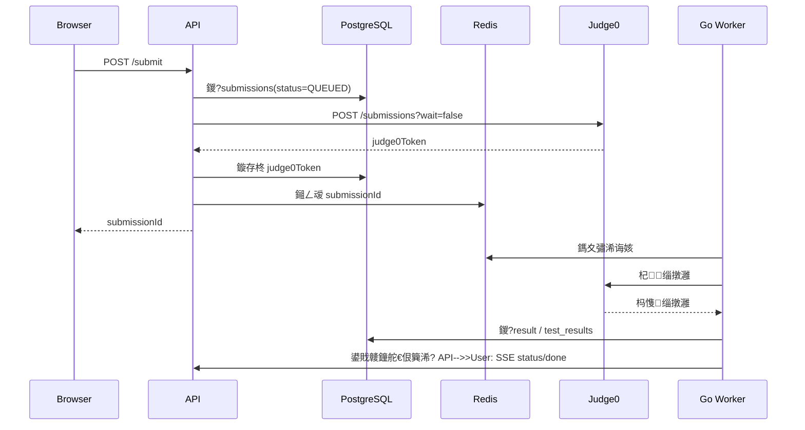

# C++ 瓒ｅ懗瀛︿範缃戠珯鍏蜂綋瀹炵幇鏂规

## 1. 鎬讳綋瀹炵幇鎬濊矾

閲囩敤鈥滀富绔欐ā鍧楀寲鍗曚綋 + 鐙珛鍒ら鏈嶅姟 + 鍐呭瀵煎叆娴佹按绾库€濈殑涓夊眰鏂规锛?
1. 涓荤珯璐熻矗鐢ㄦ埛銆佽绋嬨€侀搴撱€佽繘搴︺€佹垚闀裤€佸悗鍙般€?2. 鍒ら鏈嶅姟鐙珛閮ㄧ讲锛岃礋璐ｄ笉鍙俊浠ｇ爜缂栬瘧鎵ц銆?3. 鍐呭瀵煎叆娴佹按绾挎妸 `docx` 璇句欢杞负鍙彂甯冪殑璇剧▼鑽夌鍜岄鐩崏绋裤€?
## 2. 鎺ㄨ崘鎶€鏈爤

| 灞?| 鎶€鏈缓璁?| 璇存槑 |
| --- | --- | --- |
| Web 鍓嶇 | `Next.js` + `TypeScript` + `Tailwind CSS` | 椤甸潰銆丼SR銆佸悗鍙板叡鐢ㄤ竴濂楀伐绋嬭兘鍔?|
| 缁勪欢搴?| `shadcn/ui` 鎴栧悓绫诲師瀛愮粍浠?| 鍔犲揩鍚庡彴鍜屽唴瀹归〉鎼缓 |
| 缂栬緫鍣?| `Monaco Editor` | PC 绔唬鐮佺紪杈戜綋楠?|
| 鐘舵€佺鐞?| `TanStack Query` + `Zustand` | 鎺ュ彛缂撳瓨 + 鏈湴浜や簰鐘舵€?|
| API 鏈嶅姟 | `Go` + `chi` + `net/http` | 閫傚悎褰撳墠鍗曚粨澶氭湇鍔°€丼SE銆侀壌鏉冧笌鎺ュ彛鍒嗗眰 |
| 鏁版嵁搴?| `PostgreSQL` | 涓庣爺绌舵姤鍛婁竴鑷达紝閫傚悎 jsonb 鍐呭鍧?|
| 鏁版嵁璁块棶 | `pgx/v5` + `sqlc` | 鏇磋创杩戝綋鍓?Go API 涓庡悗缁?Worker 鍏变韩鏁版嵁灞?|
| 缂撳瓨/闃熷垪 | `Redis` | 闄愭祦銆佹帓琛屾銆佹彁浜ら槦鍒椾笌 Worker 鍗忚皟 |
| 鍒ら | `Judge0 CE` | 鐢?`worker` 璐熻矗寮傛鎻愪氦銆佽疆璇笌缁撴灉鍥炲啓 |
| 瀹炴椂鎺ㄩ€?| `SSE` | 鍓嶇浼樺厛閫氳繃 `submissions/:id/stream` 璁㈤槄鐘舵€侊紝澶辫触鏃跺洖閫€杞 |
| 鍙鍖?Demo | `Emscripten` + `WebAssembly` | 鏍?鍫嗐€佹寚閽?寮曠敤鍔ㄧ敾 |
| 瀵硅薄瀛樺偍 | `S3` 鍏煎瀛樺偍 | 璇剧▼鍥剧墖銆佸鍏ヨ祫浜с€佸浠?|
| 閮ㄧ讲 | `Docker Compose`锛圡VP锛?| 12 鍛ㄥ唴鏈€鏄撹惤鍦?|
| 鐩戞帶 | `Prometheus` + `Grafana` + `OpenTelemetry` | 鎸囨爣銆佸憡璀︺€侀摼璺?|

## 3. 绯荤粺鏋舵瀯

```mermaid
flowchart LR
    U[鐢ㄦ埛娴忚鍣╙ --> W[Web 鍓嶇 Next.js]
    W --> A[API 鏈嶅姟 Go]
    A --> P[(PostgreSQL)]
    A --> R[(Redis)]
    A --> O[(Object Storage)]
    A --> J[Judge0 CE]
    R --> K[Go Worker]
    K --> J
    K --> P
    K --> R
    C[鍐呭瀵煎叆娴佹按绾縘 --> O
    C --> P
```

### 3.1 涓荤珯杈圭晫

- `auth`锛氭敞鍐屻€佺櫥褰曘€佸埛鏂般€侀€€鍑?- `users`锛氫釜浜轰俊鎭€佹垚闀胯褰?- `paths`锛氬涔犲湴鍥?- `courses` / `lessons`锛氬唴瀹硅鍙栥€佸彂甯冪増鏈?- `problems`锛氶鐩€佹爣绛俱€佹ā鏉夸唬鐮併€佹祴璇曢厤缃?- `submissions`锛氳繍琛?鎻愪氦璁板綍
- `gamification`锛氱粡楠屽€笺€佽繛缁涔犮€佸窘绔犮€佹帓琛屾
- `admin`锛氳绋嬬紪杈戙€侀鐩鐞嗐€佺敤渚嬩笂浼犮€佸璁?
### 3.2 鍒ら杈圭晫

- 骞冲彴鍙笌 Judge0 API 閫氳銆?- Judge0 鍙帴鍙椾富绔欒闂紝涓嶆毚闇插叕缃戞垨浠呭鐧藉悕鍗曞紑鏀俱€?- 涓荤珯淇濆瓨 `submissionId` 涓?`judge0Token` 鐨勬槧灏勩€?
## 4. 宸ョ▼鐩綍寤鸿

```text
frontend/content/assets/
  raw/                 # 鍘熷 PDF / DOCX
  research/            # 鐮旂┒璧勬枡涓庢娊鍙栫瑪璁?frontend/content/docs/
  product/             # PRD銆佽绋嬪湴鍥?  technical/           # Spec銆佸疄鏂芥柟妗堛€佹妧鏈爤璇存槑
  execution/           # 鎵ц璁″垝銆佷换鍔℃媶瑙ｃ€佸彂甯冩柟妗?backend/meta/generated/
  prd/                 # PRD 鑽夌
  spec/                # Spec 鑽夌
  execution/           # 鎵ц璁″垝鑽夌
backend/meta/preparation/
  intake/              # 浠诲姟鍙楃悊
  questions/           # 寰呯‘璁ら」
  decisions/           # 鍐崇瓥璁板綍
backend/meta/specification/
  project-specification.md
backend/meta/templates/
  prompts/             # PRD / Spec / 鎵ц璁″垝鐢熸垚妯℃澘
backend/meta/skills/
  ...                  # 鍙鐢ㄦ妧鑳?```

## 5. 鏁版嵁妯″瀷钀藉湴

### 5.1 鐩存帴閲囩敤鐮旂┒鎶ュ憡涓殑鏍稿績琛?
- `users`
- `user_credentials`
- `refresh_tokens`
- `courses`
- `lessons`
- `lesson_blocks`
- `problems`
- `test_cases`
- `submissions`
- `submission_results`
- `submission_test_results`
- `user_lesson_progress`
- `xp_logs`
- `achievements`
- `user_achievements`
- `audit_events`

### 5.2 寤鸿琛ュ厖鐨勫疄鐜拌〃

- `paths`锛氬涔犺矾寰勫畾涔?- `path_nodes`锛氳矾寰勮妭鐐逛笌瑙ｉ攣鍏崇郴
- `lesson_problem_links`锛歭esson 涓?problem 鐨勫叧鑱?- `content_import_jobs`锛歞ocx 瀵煎叆浠诲姟璁板綍
- `content_assets`锛氬浘鐗囥€侀檮浠躲€佸皝闈?- `streak_snapshots`锛氳繛缁涔犲揩鐓?
### 5.3 鍏抽敭寤烘ā鍘熷垯

- `lesson_blocks.content` 浣跨敤 `jsonb`銆?- 鏍囩瀛楁浣跨敤鏁扮粍鎴?jsonb锛屽苟寤虹珛 GIN 绱㈠紩銆?- `submissions` 鎸夋湀鍒嗗尯锛岄檷浣庨暱鍛ㄦ湡鑶ㄨ儉鍘嬪姏銆?- 娴嬭瘯鐢ㄤ緥琛ㄦ敮鎸?`is_hidden`銆乣weight`銆乣group_name`銆?- 鎵€鏈夊彂甯冨唴瀹归噰鐢ㄢ€滆崏绋跨増 / 宸插彂甯冪増鈥濆弻鐘舵€併€?
## 6. 鍐呭瀵煎叆鏂规

杩欐槸鏈」鐩尯鍒簬鏅€氶搴撶珯鐨勫叧閿€?
### 6.1 瀵煎叆鐩爣

鎶?`C++鍩虹璇句欢鍜屾簮浠ｇ爜锛堟湁Linux锛?docx` 鍙樻垚鍙寔缁閲忕淮鎶ょ殑缁撴瀯鍖栧唴瀹癸紝涓嶈姹傞暱鏈熸墜宸ュ鍒剁矘璐淬€?
### 6.2 瀵煎叆瑙勫垯

1. 璇诲彇 docx 娈佃惤涓庢牱寮忋€?2. `Heading 1` 璇嗗埆涓?lesson 璧风偣銆?3. `Heading 2/3` 璇嗗埆涓哄皬鑺傘€?4. 璇嗗埆浠ｇ爜娈碉細
   - 浠?`#include`銆乣int main()`銆乣using namespace`銆乣cout`銆乣cin`銆乣class`銆乣struct`銆乣template`銆乣g++`銆乣yum` 绛夐珮棰戞ā寮忎负鐗瑰緛锛?   - 杩炵画澶氳浠ｇ爜鍚堝苟涓轰竴涓唬鐮佸潡銆?5. 璇嗗埆鈥滅ず渚嬧€濃€滆娉曗€濃€滄敞鎰忊€濃€滀綔涓氣€濈瓑璇箟娈佃惤锛屾槧灏勪负涓嶅悓 block銆?6. 鎻愬彇鍥剧墖鍒?`content-source/frontend/content/assets/`锛屽湪 block 涓啓鍏ヨ祫婧愬紩鐢ㄣ€?7. 涓烘瘡鑺傝鐢熸垚鏍囧噯 JSON 鑽夌銆?
### 6.3 鏍囧噯鍖栧悗鐨?lesson 缁撴瀯绀轰緥

```json
{
  "lessonNo": 50,
  "title": "鎸囬拡鐨勫熀鏈蹇?,
  "difficulty": 2,
  "tags": ["鎸囬拡", "鍐呭瓨", "鍩虹璇硶"],
  "prerequisites": [46, 48],
  "blocks": [
    {
      "type": "text",
      "content": {
        "title": "瀛︿範鐩爣",
        "body": "鐞嗚В鍦板潃銆佹寚閽堝彉閲忓拰瑙ｅ紩鐢ㄣ€?
      }
    },
    {
      "type": "code",
      "content": {
        "language": "cpp",
        "source": "#include <iostream>\\n..."
      }
    },
    {
      "type": "runner",
      "content": {
        "language": "cpp",
        "starterCode": "#include <iostream>\\n...",
        "stdinPreset": "",
        "timeLimitMs": 2000,
        "memoryLimitKb": 131072
      }
    },
    {
      "type": "wasm_demo",
      "content": {
        "demoKey": "pointer-basics"
      }
    }
  ]
}
```

### 6.4 鍐呭 QA 娴佺▼

姣忚妭璇惧鍏ュ悗蹇呴』缁忚繃鍥涙锛?
1. 缁撴瀯鏍￠獙锛氭爣棰樸€佹爣绛俱€佸厛淇叧绯绘槸鍚﹀畬鏁淬€?2. 杩愯鏍￠獙锛氱ず渚嬩唬鐮佽兘鍚︾紪璇戣繍琛屻€?3. 鏁欑爺鏍￠獙锛氳瑙ｆ枃瀛椾笌 docx 鍘熸枃涓€鑷达紝蹇呰鏃跺仛杞诲害浜掕仈缃戝寲鏀瑰啓銆?4. 鍙戝竷鏍￠獙锛氶鐩€乆P銆佽В閿佸叧绯汇€佸皝闈€佸彲瑙佹€у畬鏁淬€?
## 7. 鍓嶇瀹炵幇鏂规

## 7.1 椤甸潰娓呭崟

- `/`
- `/paths`
- `/paths/[slug]`
- `/courses/[slug]`
- `/lessons/[id]`
- `/problems`
- `/problems/[slug]`
- `/me`
- `/leaderboard`
- `/admin`

### 7.2 鏍稿績缁勪欢

- `PathMap`
- `PathNodeCard`
- `LessonBlockRenderer`
- `CodeEditor`
- `RunnerPanel`
- `SubmissionStatusStream`
- `ProblemStatement`
- `TestResultPanel`
- `AchievementToast`
- `AdminContentEditor`

### 7.3 Lesson 椤靛竷灞€

- 椤堕儴锛歭esson 鏍囬銆佽繘搴︺€侀璁℃椂闀裤€佸厛淇彁绀?- 涓诲尯鍩熷乏渚э細鏂囨湰璁茶В銆佹彁绀恒€佸浘鐗囥€乄ASM demo
- 涓诲尯鍩熷彸渚э細Monaco 缂栬緫鍣ㄣ€佽繍琛?鎻愪氦鎸夐挳銆佽緭鍑洪潰鏉?- 搴曢儴锛氭湰鑺傜粌涔犮€侀€氳繃鏉′欢銆佷笅涓€鑺傛寜閽?
### 7.4 鐘舵€佺鐞?
- 璇剧▼/棰樺簱鏁版嵁锛歚TanStack Query`
- 缂栬緫鍣ㄤ唬鐮佽崏绋匡細鏈湴鐘舵€?+ `localStorage`
- 鎻愪氦鐘舵€侊細SSE 椹卞姩
- 鎴愰暱寮瑰眰锛氬叏灞€杞荤姸鎬?
## 8. 鍚庣瀹炵幇鏂规

### 8.1 API 鍒嗗眰

- `Handler`锛欻TTP / SSE 鍏ュ彛
- `Service`锛氫笟鍔＄紪鎺?- `Repository`锛氭暟鎹闂?- `Worker`锛氬紓姝ユ秷璐逛笌缁撴灉鍥炲啓
- `Middleware`锛氶壌鏉冦€侀檺娴併€佽鑹叉帶鍒?
### 8.2 鏍稿績鎺ュ彛

- `POST /api/v1/auth/register`
- `POST /api/v1/auth/login`
- `POST /api/v1/auth/refresh`
- `POST /api/v1/auth/logout`
- `GET /api/v1/me`
- `GET /api/v1/paths`
- `GET /api/v1/paths/:slug`
- `GET /api/v1/courses`
- `GET /api/v1/courses/:slug`
- `GET /api/v1/lessons/:id`
- `POST /api/v1/lessons/:id/complete`
- `GET /api/v1/problems`
- `GET /api/v1/problems/:slug`
- `POST /api/v1/run`
- `POST /api/v1/submit`
- `GET /api/v1/submissions/:id`
- `GET /api/v1/submissions/:id/stream`
- `GET /api/v1/progress`
- `GET /api/v1/leaderboards/xp`
- `GET /api/v1/achievements`
- `POST /api/v1/admin/courses`
- `POST /api/v1/admin/problems`
- `POST /api/v1/admin/testcases/upload`

### 8.3 鎻愪氦閾捐矾



### 8.4 杩愯涓庢彁浜ょ殑涓氬姟宸紓

- `run`锛氱敤浜庤鍫傚唴蹇€熷弽棣堬紝鍙笉瑕佹眰棰樼洰涓婁笅鏂囥€?- `submit`锛氱敤浜庢寮忓垽棰橈紝蹇呴』缁戝畾 `problemId` 骞朵娇鐢ㄩ殣钘忕敤渚嬨€?- 涓よ€呴兘璁板綍 `submission`锛屼絾 `type` 涓嶅悓銆?
## 9. Judge0 涓庡畨鍏ㄧ瓥鐣?
### 9.1 Judge0 閰嶇疆寤鸿

- `cpu_time_limit`: 2
- `wall_time_limit`: 5~10
- `memory_limit`: 131072~262144
- `max_processes_and_or_threads`: 60
- `max_file_size`: 1024
- `enable_network`: false

### 9.2 骞冲彴闃叉姢

- Rootless Docker
- seccomp
- AppArmor
- Judge0 浠呯櫧鍚嶅崟璁块棶
- 鐧诲綍涓庢彁浜ゆ帴鍙ｉ檺娴?- 鎻愪氦婧愮爜淇濆瓨 hash锛屽繀瑕佹椂鍔犲瘑鍘熸枃

## 10. 娓告垙鍖栫郴缁熷疄鐜?
### 10.1 XP 瑙勫垯寤鸿

- 瀹屾垚 lesson锛?0 XP
- 棣栨閫氳繃灏忔祴锛?0 XP
- 棣栨閫氳繃缂栫▼棰橈細30 XP
- 姣忔棩棣栨瀛︿範锛?0 XP
- 杩炵画瀛︿範绗?3/7/14/30 澶╋細棰濆濂栧姳

### 10.2 鎺掕姒?
- Redis Sorted Set 瀛樻€绘涓庡懆姒?- 姣忔 XP 鍙樺寲鍚屾鍐欏簱涓庢洿鏂扮紦瀛?- 鍛ㄦ鎸夎嚜鐒跺懆娓呯畻

### 10.3 寰界珷瑙﹀彂

- 瑙勫垯寮曟搸閲囩敤绠€鍗曚簨浠堕┍鍔細
  - `lesson.completed`
  - `problem.accepted`
  - `streak.updated`
  - `path.finished`

## 11. 杩愮淮涓庡彂甯?
### 11.1 鐜瑙勫垝

- `dev`锛氭湰鍦拌仈璋?- `staging`锛氶泦鎴愰獙璇?- `prod`锛氭寮忕幆澧?
### 11.2 MVP 閮ㄧ讲鎷撴墤

- 1 鍙?App VM锛歚web + api`
- 1 鍙?Worker VM 鎴栦笌 App 鍚屾満璧锋
- 1 鍙?Judge VM锛氬崟鐙儴缃?Judge0
- 鎵樼 PostgreSQL
- Redis
- 瀵硅薄瀛樺偍

### 11.3 CI/CD

- PR锛歭int + typecheck + unit test + build
- main锛歜uild image 鈫?deploy staging 鈫?e2e 鈫?manual approval 鈫?deploy prod
- 鏁版嵁杩佺Щ鍗曠嫭姝ラ鎵ц锛岄伩鍏嶉殣寮忎笂绾?
### 11.4 鍙娴嬫€?
- 鎺ュ彛鑰楁椂銆侀敊璇巼銆丼SE 杩炴帴鏁?- 闃熷垪闀垮害銆佸垽棰樺け璐ョ巼
- DB 鎱㈡煡璇€佽繛鎺ユ暟
- 澶囦唤浠诲姟鎴愬姛鐜?
## 12. 12 鍛ㄨ惤鍦版帓鏈?
| 鍛ㄦ | 浜や粯閲嶇偣 | 璐熻矗浜?| 楠屾敹鏍囧噯 |
| --- | --- | --- | --- |
| W1 | 闇€姹傚喕缁撱€佷俊鎭灦鏋勩€佽〃缁撴瀯銆佹帴鍙ｈ崏妗堛€乨ocx 瑙ｆ瀽 POC | 浜у搧/鍚庣 | 29 鑺傝缁撴瀯鏄犲皠鍙‘璁?|
| W2 | 閴存潈銆佺敤鎴蜂腑蹇冦€佽绋嬪垪琛ㄣ€佽矾寰勫彧璇绘帴鍙ｃ€佸墠绔鏋?| FE/BE | 鐧诲綍涓庤绋嬫祻瑙堝彲鐢?|
| W3 | LessonBlockRenderer銆丮onaco銆丷unnerPanel | FE | 绔犺妭椤靛彲娓叉煋骞惰繍琛岀ず渚?|
| W4 | Judge0 鑷墭绠°€佹彁浜ゅ紓姝ュ寲銆丼SE 鐘舵€佹祦 | BE/DevOps | 鎻愪氦閾捐矾璺戦€?|
| W5 | 棰樺簱銆佺敤渚嬨€佹彁浜よ褰曘€佹帓琛屾 | BE | 棰樼洰鍙寮忔彁浜?|
| W6 | 鍚庡彴 MVP銆佸唴瀹瑰鍏ュ伐鍏?v1銆佸璁°€侀檺娴?| BE | 鍙粠鍚庡彴鍙戝竷璇剧▼/棰樼洰 |
| W7 | WASM Demo 1锛氭爤/鍫嗕笌 new/delete | FE | Demo 鍙氦浜?|
| W8 | WASM Demo 2锛氭寚閽?寮曠敤 + Debug 棰樺瀷 | FE/鏁欑爺 | 2 涓?demo 瀹屾暣 |
| W9 | 鐩戞帶銆佸煁鐐广€佹棩蹇椼€佸浠?| DevOps | 鍩虹鍛婅涓庢仮澶嶆紨缁冨畬鎴?|
| W10 | 瀹夊叏鍔犲浐銆佸帇娴嬨€佺伆搴﹀彂甯冩祦绋?| DevOps | 鍒ら榛樿绂佺綉涓斿彲杩借釜 |
| W11 | 鐏屽叆 29 鑺傝 + 120 棰?+ 30 鎴愬氨 | 鏁欑爺/鍐呭 | 鏂版墜鏉戝叏閾捐矾鍙蛋閫?|
| W12 | 鍥炲綊娴嬭瘯銆佷笂绾裤€侀鍙戣繍钀ユ椿鍔?| 鍏ㄥ憳 | 姝ｅ紡鍙敤 |

## 13. 鐮斿彂绗竴鎵?backlog

寤鸿鎸変互涓嬮『搴忓紑宸ワ細

1. 寤哄簱涓庤縼绉昏剼鎵嬫灦
2. `auth` 妯″潡
3. `paths/courses/lessons` 鍙鎺ュ彛
4. LessonBlock schema
5. docx 瑙ｆ瀽鍣?POC
6. Monaco 鎺ュ叆
7. `run` 鎺ュ彛
8. Judge0 鎻愪氦涓庡洖鍐?9. SSE 鐘舵€佹祦
10. 棰樺簱涓庣敤渚嬬鐞?11. XP/鎺掕姒?12. 鍚庡彴璇剧▼缂栬緫鍣?13. WASM demo
14. 鐩戞帶涓庡浠?
## 14. 缁撹

鐪熸鍐冲畾杩欎釜椤圭洰鎴愯触鐨勪笉鏄€滆兘涓嶈兘鎶婁唬鐮佽窇璧锋潵鈥濓紝鑰屾槸锛?
1. 鑳戒笉鑳芥妸 `docx` 鐨?212 涓富棰樼ǔ瀹氳浆鎴愮粨鏋勫寲璇剧▼璧勪骇锛?2. 鑳戒笉鑳藉厛鐢?29 鑺傞珮瀹屾垚搴﹁绋嬫墦鍑虹涓€鏉￠棴鐜矾寰勶紱
3. 鑳戒笉鑳芥妸 Judge0銆丼SE銆佹垚闀跨郴缁熷拰鍚庡彴鍙戝竷涓叉垚浣庤繍缁存垚鏈殑 MVP銆?
寤鸿鍏堟寜鏈柟妗堣惤 `29 鑺?+ 120 棰?+ 2 涓?Demo + 1 鏉¤矾寰刞锛屽悗缁啀閫愭鎵╁厖鍒板畬鏁?C++ 涓?Linux / 缃戠粶浣撶郴銆?


