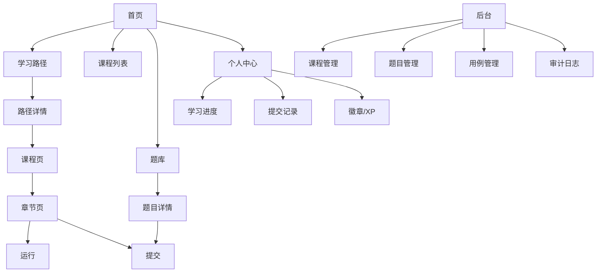

# C++ 趣味学习网站 PRD

## 1. 文档信息

| 项 | 内容 |
| --- | --- |
| 文档名称 | C++ 趣味学习网站 PRD |
| 当前版本 | v1.0 |
| 文档状态 | 评审稿 |
| 产品阶段 | 0→1 MVP |
| 更新时间 | 2026-03-08 |
| 适用范围 | 产品、设计、前端、后端、测试、教研、运营 |
| 关联文档 | `docs/technical/cpp-fun-learning-spec.md`、`docs/technical/cpp-fun-learning-implementation.md`、`docs/technical/go-docker-stack.md`、`docs/product/course-map-from-docx.md` |

## 2. 产品背景

### 2.1 背景描述

现有 `C++基础课件和源代码（有Linux）.docx` 已具备较完整的课程体系，覆盖：

- C++ 基础语法
- 指针、内存、数组、结构体、引用
- 类、继承、多态、模板
- STL、智能指针、异常、文件
- Linux、进程、共享内存、网络编程

但原始内容主要以传统课件和示例代码形式存在，存在以下问题：

- 学习路径是线性的，缺乏闯关和解锁反馈；
- 学员看课与写代码分离，练习闭环弱；
- 教研内容难以版本化、结构化和后台化维护；
- 课程价值主要停留在文档层，难以持续运营和数据化迭代；
- 对指针、内存、引用等抽象概念，传统课件理解成本高、劝退率高。

### 2.2 机会点

如果将原始课件升级为在线学习产品，可形成以下优势：

- 以学习路径组织内容，提高完课率；
- 通过在线运行和正式判题，把“看懂”转化为“会做”；
- 通过经验值、徽章、连续学习和排行榜提升留存；
- 通过后台发布和内容结构化，形成可持续迭代的课程资产；
- 通过栈/堆、指针/引用等可视化 Demo，降低 C++ 入门门槛。

## 3. 产品定位

### 3.1 一句话定义

一个面向 C++ 初学者到进阶学习者的游戏化在线学习网站，通过“学习地图 + 边学边练 + 在线运行/判题 + 成长反馈”帮助用户系统掌握 C++ 与相关 Linux 实践能力。

### 3.2 产品使命

- 帮助零基础用户从第一个 C++ 程序开始完成第一条学习路径；
- 帮助有一定基础的用户通过题库和专题路径强化薄弱点；
- 帮助教研团队把离散课件升级为可运营的数字化课程平台。

### 3.3 核心价值

1. 把 docx 课件转成结构化课程资产；
2. 把课堂示例变成可运行、可提交、可反馈的练习；
3. 把复杂概念做成可视化互动组件；
4. 把学习行为沉淀为进度、经验值、徽章和排行榜；
5. 把内容、题库、发布和审计纳入统一后台。

## 4. 产品目标

### 4.1 MVP 产品目标

在 12 周内上线一版可闭环的 C++ 学习产品，满足以下目标：

- 上线 1 条主学习路径；
- 覆盖 29 节核心课程；
- 上线 120 道题；
- 支持运行与正式提交；
- 支持学习进度与成长反馈；
- 支持后台发布课程和题目；
- 支持基础监控、备份与审计。

### 4.2 业务目标

- 首月注册用户：5,000
- 首月 DAU：500
- 首课完成率：≥65%
- 新手村完整通关率：≥25%
- 运行到提交转化率：≥30%

### 4.3 用户目标

- 用户能在首次进入后快速开始学习，不被复杂配置吓退；
- 用户能在单节课内完成“看讲解 → 跑样例 → 做练习 → 获得反馈”；
- 用户能在完成一段学习后获得明显的成长感和解锁反馈。

## 5. 非目标

以下内容不纳入本期 PRD 范围：

- 社区论坛
- 多人协作编程
- AI 自动出题
- AI 自动讲题
- 复杂赛事系统
- 多语言国际化
- 移动端完整写代码体验

## 6. 目标用户

### 6.1 用户分层

| 用户类型 | 特征 | 核心诉求 |
| --- | --- | --- |
| 零基础用户 | 刚接触编程或仅接触过 C 语言 | 有清晰起点、低门槛、强反馈 |
| 在校学生 | 有课程、考试、作业驱动 | 系统练习、排行榜、提交记录 |
| 进阶用户 | 想补 STL、现代 C++、Linux | 专题路径、题库强化、知识体系化 |
| 教研/内容编辑 | 负责内容生产和更新 | 标准化导入、可编辑、可发布、可回滚 |
| 管理员/运营 | 负责活动和平台维护 | 发布效率、数据看板、审计风控 |

### 6.2 核心用户画像

#### 用户画像 A：大一新生

- 年龄：18–20
- 基础：会基础电脑操作，不会写代码或仅学过一点 C
- 目标：完成课程作业，学会最基本的语法和程序思维
- 典型痛点：
  - 不会配环境
  - 看得懂课件但不会写
  - 指针、引用、内存完全抽象

#### 用户画像 B：提升型工程师

- 年龄：22–30
- 基础：有 Java / Python / 前端经验
- 目标：补齐 C++ 基础和系统编程能力
- 典型痛点：
  - 学习路径不清晰
  - 资料零散，知识点跳跃
  - 缺少可验证练习

## 7. 使用场景

### 7.1 核心场景 1：首次进入，开始学习

用户打开网站后：

1. 浏览首页；
2. 看到推荐路径和个人进度；
3. 注册/登录；
4. 进入“C++ 新手村”；
5. 进入第一节课；
6. 运行第一个示例程序；
7. 完成第一节课并解锁下一节。

### 7.2 核心场景 2：边学边练

用户在章节页：

1. 阅读本节核心概念；
2. 修改示例代码；
3. 点击运行；
4. 查看输出；
5. 完成一个小测；
6. 通过本节挑战题；
7. 获得 XP 和徽章反馈。

### 7.3 核心场景 3：刷题强化

用户在题库：

1. 按标签和难度筛选；
2. 进入题目详情；
3. 编写代码并提交；
4. 查看结果和失败原因；
5. 回到课程补弱点。

### 7.4 核心场景 4：后台内容发布

内容编辑：

1. 导入或新建课程；
2. 编辑 lesson blocks；
3. 绑定练习题和解锁规则；
4. 发布课程；
5. 前台立即可见；
6. 所有操作记录到审计日志。

## 8. 版本范围

### 8.1 MVP 范围

#### 内容范围

- 29 节核心课程
- 120 道题
- 2 个 WASM Demo
- 1 条主学习路径
- 30 个左右徽章

#### 功能范围

- 注册/登录/刷新/退出
- 首页
- 学习地图
- 课程页
- 章节页
- 在线运行
- 正式提交
- SSE 状态推送
- 题库列表/详情
- 个人中心
- 排行榜
- 后台管理 MVP

### 8.2 首发后 1 期范围

- 扩展基础语法剩余课节
- 扩展指针/数组/结构体/引用专题
- 增加 Linux 入门支线
- 增加基于标签的练习推荐
- 增加离线代码相似度检测

## 9. 信息架构

## 10. 用户旅程

### 10.1 首次学习旅程

| 阶段 | 用户行为 | 用户感受 | 产品目标 |
| --- | --- | --- | --- |
| 发现 | 打开首页 | 好奇、观望 | 让用户知道“这是一个能边学边练的 C++ 学习站” |
| 注册 | 注册并登录 | 轻微成本 | 尽量缩短首次进入时长 |
| 进入路径 | 点击推荐路径 | 有方向感 | 提供明确起点 |
| 开始课程 | 进入第一节课 | 需要低门槛 | 快速获得第一次成功 |
| 运行示例 | 修改代码并运行 | 新鲜感 | 建立“能跑起来”的正反馈 |
| 完成课程 | 完成本节 | 成就感 | 推动继续学习 |
| 解锁下一节 | 自动解锁 | 成长感 | 增加留存 |

### 10.2 留存旅程

| 触点 | 设计目标 |
| --- | --- |
| 首页继续学习卡片 | 降低回访成本 |
| 路径解锁动效 | 提升前进动力 |
| XP/徽章/连续学习 | 增强成就反馈 |
| 题库推荐 | 增加练习频次 |
| 排行榜 | 形成社交比较与挑战心智 |

## 11. 功能需求总览

| 模块 | 优先级 | 是否 MVP |
| --- | --- | --- |
| 账号系统 | P0 | 是 |
| 首页 | P0 | 是 |
| 学习路径/地图 | P0 | 是 |
| 课程/章节内容 | P0 | 是 |
| 在线运行 | P0 | 是 |
| 正式提交/判题 | P0 | 是 |
| 题库 | P0 | 是 |
| 学习进度 | P0 | 是 |
| XP/徽章/排行榜 | P0 | 是 |
| 后台管理 | P0 | 是 |
| WASM Demo | P1 | 是 |
| 练习推荐 | P1 | 否 |
| 抄袭检测 | P1 | 否 |
| 班级/活动系统 | P2 | 否 |

## 12. 模块级 PRD

### 12.1 账号系统

#### 12.1.1 目标

提供稳定的账号体系，支持用户身份识别、进度保存和后续成长系统绑定。

#### 12.1.2 功能点

- 邮箱注册
- 密码登录
- Refresh Token 刷新
- 退出登录
- 当前用户信息获取

#### 12.1.3 规则

- 用户名默认为昵称，可修改但需校验长度和敏感词；
- 密码需满足最小强度要求；
- 连续登录失败超过阈值触发限流或临时锁定；
- Refresh Token 放入 `httpOnly Cookie`。

#### 12.1.4 验收标准

- 注册后自动获得可用登录态；
- 登录、刷新、退出可完整闭环；
- 非法凭证被正确拦截；
- 密码不明文存储。

### 12.2 首页

#### 12.2.1 目标

帮助用户快速理解平台价值并进入学习。

#### 12.2.2 页面模块

- 顶部导航
- Hero 区
- 推荐路径卡片
- 继续学习卡片
- 平台亮点
- 排行榜预览
- 页脚

#### 12.2.3 交互规则

- 未登录用户显示注册/登录 CTA；
- 已登录用户优先显示“继续学习”；
- 如果用户无进度，则展示推荐路径和新手入口。

#### 12.2.4 验收标准

- 用户可在 3 次点击内进入第一节课；
- 已登录用户可一键回到上次学习位置。

### 12.3 学习路径 / 地图

#### 12.3.1 目标

通过闯关结构承接课程主线，给用户明确方向和成长反馈。

#### 12.3.2 核心对象

- Path
- Node
- Lesson
- UnlockRule
- Reward

#### 12.3.3 页面模块

- 路径封面
- 路径介绍
- 地图节点流
- 节点状态
- 奖励弹层
- 学习统计

#### 12.3.4 节点状态

- 未解锁
- 已解锁未开始
- 学习中
- 已完成

#### 12.3.5 解锁规则

默认规则：

- 完成当前 lesson；
- 达到最低通过分；
- 若存在挑战题，则通过挑战题后解锁下一节点。

#### 12.3.6 验收标准

- 节点状态正确展示；
- 未满足条件不可进入锁定节点；
- 完成节点后自动解锁后续节点。

### 12.4 课程页

#### 12.4.1 目标

让用户了解课程结构、章节数量、完成度和开始入口。

#### 12.4.2 页面模块

- 课程标题和简介
- 难度与标签
- 章节列表
- 完成度
- 开始学习按钮

#### 12.4.3 交互规则

- 若用户已有进度，则按钮文案为“继续学习”；
- 每个章节展示状态、预计时长、是否解锁；
- 支持从课程页进入任一已解锁章节。

### 12.5 章节页（Lesson）

#### 12.5.1 目标

打造核心学习体验，完成“讲解 + 运行 + 小测 + 提交”闭环。

#### 12.5.2 页面布局

- 顶部：章节标题、进度、预计时长、返回路径
- 内容区：LessonBlockRenderer
- 编辑区：Monaco Editor
- 输出区：RunnerPanel
- 底部：本节小结、完成按钮、下一节入口

#### 12.5.3 支持的内容块类型

- `text`
- `code`
- `quiz`
- `runner`
- `debug`
- `challenge`
- `wasm_demo`
- `summary`

#### 12.5.4 关键交互

- 用户可直接运行示例代码；
- 用户可点击“恢复默认代码”；
- 用户在小测完成后可立即看到结果；
- 用户完成本节时自动更新学习进度；
- 如果本节有关联挑战题，完成按钮应校验通过状态。

#### 12.5.5 验收标准

- 每节课至少含 1 个交互块；
- 示例代码可正常加载到编辑器；
- 运行结果在合理时间内返回或显示排队状态；
- 本节完成状态能同步更新到路径和个人中心。

### 12.6 在线运行

#### 12.6.1 目标

让用户在学习过程中低成本尝试代码，快速获得反馈。

#### 12.6.2 入口

- Lesson 中 runner block
- 题目详情页的运行按钮

#### 12.6.3 规则

- 运行不计正式成绩；
- 运行允许自定义标准输入；
- 运行结果展示：
  - stdout
  - stderr
  - compile output
  - time
  - memory
- 运行请求需限流。

#### 12.6.4 异常状态

- 编译失败
- 运行超时
- 运行超内存
- 沙箱错误
- 队列拥堵

### 12.7 正式提交 / 判题

#### 12.7.1 目标

对正式编程题做隐藏用例判定，形成可追溯的学习成绩记录。

#### 12.7.2 提交流程

1. 用户点击提交；
2. 前端收到 `submissionId`；
3. 前端通过 SSE 订阅状态；
4. 后端异步编排 Judge0；
5. 回写结果；
6. 前端展示最终判定。

#### 12.7.3 状态定义

- `QUEUED`
- `RUNNING`
- `ACCEPTED`
- `WRONG_ANSWER`
- `COMPILE_ERROR`
- `RUNTIME_ERROR`
- `TIME_LIMIT_EXCEEDED`
- `MEMORY_LIMIT_EXCEEDED`
- `SYSTEM_ERROR`

#### 12.7.4 规则

- 必须使用隐藏用例；
- 前端不下发隐藏用例；
- 免费用户提交次数可限额；
- 所有提交记录必须可追溯；
- 提交结果会影响 XP、题目通过记录和路径解锁。

#### 12.7.5 验收标准

- 提交请求为异步；
- 前端无需刷新即可看到状态变更；
- 结果写库后可在个人中心查看历史记录。

### 12.8 题库系统

#### 12.8.1 目标

提供独立于课程的练习空间，帮助用户按标签和难度强化训练。

#### 12.8.2 页面模块

- 筛选器
- 搜索框
- 题目卡片
- 分页
- 标签区

#### 12.8.3 题目详情页模块

- 题目标题
- 难度
- 标签
- 题面描述
- 输入输出说明
- 样例
- 编辑器
- 运行/提交按钮
- 结果面板

#### 12.8.4 题型范围

- 选择题
- 判断题
- 输出预测题
- 填空题
- Debug 修复题
- 编程判题题

#### 12.8.5 验收标准

- 支持按标签、难度筛选；
- 题目详情不泄露隐藏用例；
- 用户可查看自己的提交历史。

### 12.9 学习进度

#### 12.9.1 目标

让用户随时知道自己学到哪里、完成多少、下一步学什么。

#### 12.9.2 功能点

- 课程完成度
- 路径完成度
- 最后学习位置
- 最近学习记录
- 已完成/未完成统计

#### 12.9.3 规则

- 阅读行为本身不算完成；
- 完成 lesson 需要满足 lesson 完成条件；
- 个人中心优先展示最近继续学习入口。

### 12.10 成长系统

#### 12.10.1 目标

增强成就感、驱动连续学习和回访。

#### 12.10.2 子模块

- XP
- 徽章
- 连续学习
- 排行榜

#### 12.10.3 XP 规则

建议 MVP 规则：

- 完成 lesson：20 XP
- 小测通过：10 XP
- 编程题首次通过：30 XP
- 每日首次学习：10 XP
- 连续学习里程碑：额外奖励

#### 12.10.4 徽章规则

- 首次运行成功
- 首次提交通过
- 完成 5 节课
- 连续学习 3/7/14/30 天
- 完成“新手村”

#### 12.10.5 排行榜规则

- 总 XP 榜
- 周榜
- 支持分页
- 支持展示自己的排名

#### 12.10.6 验收标准

- XP 发放可追溯；
- 徽章可在个人中心查看；
- 排行榜稳定可用。

### 12.11 个人中心

#### 12.11.1 目标

沉淀个人学习资产，强化用户的成长感与复习便利性。

#### 12.11.2 页面模块

- 个人信息
- 最近学习
- 路径进度
- XP 与等级
- 连续学习
- 徽章墙
- 提交记录

#### 12.11.3 验收标准

- 用户能看见最近学习入口；
- 用户能查看题目提交历史；
- 用户能查看已获徽章。

### 12.12 WASM 趣味演示

#### 12.12.1 目标

用互动可视化解释 C++ 抽象概念，降低理解门槛。

#### 12.12.2 MVP Demo

- Demo 1：栈 / 堆 / `new` / `delete`
- Demo 2：指针 vs 引用

#### 12.12.3 展示要求

- 演示过程可随步骤变化更新；
- 关键变量、地址和生命周期需有视觉提示；
- 支持与本节代码示例形成联动或概念映射。

### 12.13 后台管理

#### 12.13.1 目标

让教研和运营独立完成内容录入、编辑、发布和审计。

#### 12.13.2 后台模块

- 课程管理
- 章节管理
- 内容块编辑
- 题目管理
- 测试用例管理
- 发布管理
- 徽章管理
- 路径管理
- 审计日志

#### 12.13.3 权限角色

| 角色 | 权限 |
| --- | --- |
| 超级管理员 | 全量权限 |
| 教研编辑 | 课程、题目、题库编辑与发布 |
| 运营 | 活动、推荐、部分内容配置 |
| 只读审核 | 查看数据与审计，不可修改 |

#### 12.13.4 发布规则

- 课程支持草稿和发布状态；
- 题目支持草稿和发布状态；
- 发布后前台立即可见；
- 修改行为必须记录审计日志；
- 支持版本回滚。

## 13. 内容产品化规则

### 13.1 内容层级

- Path：主题学习路径
- Course：课程集合
- Lesson：单节课程
- Block：渲染块
- Problem：练习题

### 13.2 Lesson 标准模板

每节课统一包含以下结构：

1. 学习目标
2. 核心概念
3. 示例代码
4. 互动练习
5. 易错点
6. 本节挑战
7. 本节总结

### 13.3 docx 转换规则

- `Heading 1` 转换为 Lesson；
- `Heading 2/3` 转换为小节标题；
- “示例”段落优先转成 `code` 或 `runner`；
- “注意事项”优先转成说明块和 quiz 题源；
- “课后作业”优先转成 challenge 或题单。

## 14. 业务规则

### 14.1 Lesson 完成规则

默认满足以下任一：

- 完成阅读 + 完成小测；
- 或通过本节挑战题；
- 若本节无挑战题，则完成必做互动块即可。

### 14.2 路径解锁规则

- 上一节点完成后自动解锁；
- 允许个别节点配置多先修条件；
- 锁定节点只能看概要，不可进入完整学习页。

### 14.3 XP 发放规则

- 同一行为只发一次首通奖励；
- 重复提交成功不重复发首通 XP；
- 日常活跃奖励按自然日计算。

### 14.4 提交次数规则

- `run` 与 `submit` 都有限流；
- 免费用户提交额度可配置；
- 管理员用户不受普通额度限制。

### 14.5 审计规则

- 后台创建、修改、删除、发布、回滚必须审计；
- 记录操作者、时间、IP、对象、变更内容摘要。

## 15. 页面状态与异常处理

### 15.1 通用状态

- loading
- empty
- error
- no-permission
- offline

### 15.2 关键异常文案方向

- 未登录：引导登录
- 无权限：展示权限不足
- Judge 队列繁忙：展示排队中，请稍后
- 提交失败：展示重试建议
- 移动端进入编辑场景：提示 PC 体验更佳

## 16. 埋点与数据指标

### 16.1 关键埋点

- 首页曝光
- 路径点击
- lesson 进入
- runner 运行
- submit 提交
- submit 成功/失败
- lesson 完成
- path 完成
- 继续学习点击
- 排行榜查看

### 16.2 核心指标

- 注册转化率
- 首课进入率
- 首课完成率
- 运行率
- 提交率
- 提交通过率
- 7 日留存
- 连续学习人数
- 路径完课率

## 17. 非功能需求

### 17.1 性能

- 页面首屏应在合理时间内完成可交互；
- 普通内容接口 P95 < 300ms；
- 提交接口 1 秒内返回 `submissionId`；
- 运行结果在健康情况下 5 秒内给出明确反馈或排队状态。

### 17.2 安全

- 判题默认禁网；
- 密码安全哈希；
- 提交接口限流；
- 隐藏用例不外泄；
- 后台强审计；
- 敏感配置不写死在仓库。

### 17.3 可用性

- 核心功能支持错误提示与重试；
- SSE 断线可重连；
- 后台发布失败可回滚。

### 17.4 可维护性

- 内容块 schema 标准化；
- 路径/课程/题库解耦；
- 日志、指标、追踪统一；
- 数据迁移可版本化。

## 18. 技术约束

本 PRD 对实现提出以下约束：

- 后端采用 `Go`
- 部署采用 `Docker Compose`
- 判题采用 `Judge0 CE`
- 主数据库采用 `PostgreSQL`
- 缓存采用 `Redis`
- 消息总线采用 `NATS JetStream`
- 前端编辑器采用 `Monaco Editor`
- 实时状态优先采用 `SSE`

详细技术方案见 `docs/technical/go-docker-stack.md:1`。

## 19. 依赖项

### 19.1 外部依赖

- Judge0 CE
- PostgreSQL
- Redis
- NATS
- MinIO
- 监控组件

### 19.2 内容依赖

- 原始 docx 课件
- 原始 PDF 研究报告
- 课程封面和插图资源
- 教研提供的题目和测试用例

### 19.3 组织依赖

- 产品定义 MVP 范围
- 教研确定 29 节首发课和 120 题清单
- 设计完成核心页面和状态规范
- 开发完成判题和后台最小闭环

## 20. 测试与验收

### 20.1 产品验收

- 用户能完成首次注册并进入第一节课；
- 用户能运行示例代码；
- 用户能提交题目并看到结果；
- 用户能获得 XP 和进度反馈；
- 后台能发布课程和题目。

### 20.2 测试范围

- 账号链路测试
- 路径解锁测试
- Lesson 渲染测试
- 运行/提交流程测试
- Judge 回写测试
- 成长系统测试
- 后台发布与审计测试
- 限流与异常处理测试

### 20.3 发布门槛

- 首发 29 节课全部可访问；
- 首发 120 题全部可用；
- 判题链路稳定；
- 核心指标已接入监控；
- 备份和恢复演练完成至少 1 次。

## 21. 里程碑

| 周次 | 目标 | 关键产出 |
| --- | --- | --- |
| W1 | 需求冻结 | PRD、信息架构、表结构草案 |
| W2 | 基础框架 | 登录、课程/路径接口、前端骨架 |
| W3 | 核心学习页 | LessonBlockRenderer、Monaco、RunnerPanel |
| W4 | 提交链路 | Judge0、异步提交、SSE |
| W5 | 题库闭环 | 题目、用例、提交记录、排行榜 |
| W6 | 后台 MVP | 课程/题目发布、审计、限流 |
| W7 | 趣味化 1 | 栈/堆 Demo |
| W8 | 趣味化 2 | 指针/引用 Demo、Debug 题 |
| W9 | 运维能力 | 监控、备份、埋点 |
| W10 | 安全加固 | Docker 安全、风控策略 |
| W11 | 内容灌入 | 29 节 + 120 题 + 30 徽章 |
| W12 | 上线 | 回归、上线、运营首发 |

## 22. 风险与应对

| 风险 | 表现 | 应对 |
| --- | --- | --- |
| 内容生产不足 | 功能上线但课程不足 | 先保 29 节高完成度课程，不盲目铺量 |
| 判题压力过大 | 队列积压、结果延迟 | 提交异步化、Worker 扩容、Judge 独立部署 |
| 用户入门门槛高 | 首课流失高 | 强化第一节体验、减少配置阻力、加可视化引导 |
| 指针等概念劝退 | 中段完课率低 | 引入 WASM Demo + Debug 题型 |
| 后台效率低 | 内容发布慢 | 内容块标准化、模板化录入、版本管理 |
| 审计缺失 | 出问题难追踪 | 后台强制审计、提交链路留痕 |

## 23. 开放问题

以下问题需要在评审中最终拍板：

1. 首发是否开放游客浏览部分章节；
2. 免费用户的每日 `run/submit` 配额；
3. XP 是否与等级体系挂钩；
4. 路径是否支持 A/B 学习路线；
5. 首发是否加入轻量 Linux 支线；
6. 移动端是否只开放浏览，还是允许轻量代码编辑。

## 24. 结论

本 PRD 的核心不是做一个“在线编辑器网站”，而是做一个“以课程资产为中心、以闯关路径组织、以在线运行和正式判题增强反馈、以成长系统增强留存”的 C++ 学习平台。

MVP 阶段坚持三条原则：

1. 先做完整闭环，不追求功能堆叠；
2. 先做 29 节高质量核心课，不追求一次性覆盖全部课纲；
3. 先把学习体验、提交链路、后台发布和数据追踪做扎实，再逐步扩展专题和规模。
