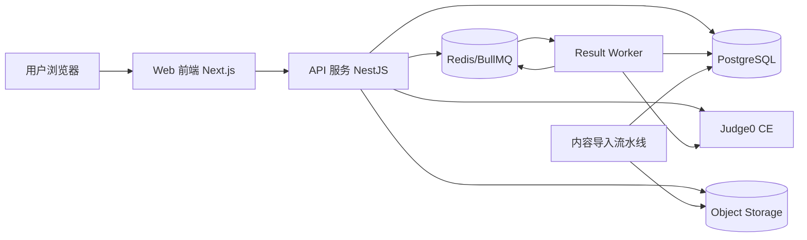
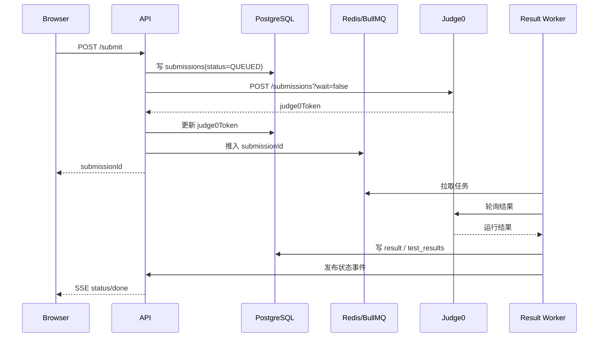

# C++ 趣味学习网站具体实现方案

## 1. 总体实现思路

采用“主站模块化单体 + 独立判题服务 + 内容导入流水线”的三层方案：

1. 主站负责用户、课程、题库、进度、成长、后台。
2. 判题服务独立部署，负责不可信代码编译执行。
3. 内容导入流水线把 `docx` 课件转为可发布的课程草稿和题目草稿。

## 2. 推荐技术栈

| 层 | 技术建议 | 说明 |
| --- | --- | --- |
| Web 前端 | `Next.js` + `TypeScript` + `Tailwind CSS` | 页面、SSR、后台共用一套工程能力 |
| 组件库 | `shadcn/ui` 或同类原子组件 | 加快后台和内容页搭建 |
| 编辑器 | `Monaco Editor` | PC 端代码编辑体验 |
| 状态管理 | `TanStack Query` + `Zustand` | 接口缓存 + 本地交互状态 |
| API 服务 | `NestJS` | 适合模块化单体、SSE、鉴权、后台接口组织 |
| 数据库 | `PostgreSQL` | 与研究报告一致，适合 jsonb 内容块 |
| ORM | `Prisma` 或 `Drizzle ORM` | 迁移与类型安全 |
| 缓存/队列 | `Redis` + `BullMQ` | 限流、排行榜、任务队列 |
| 判题 | `Judge0 CE` | 异步提交、资源限制、成熟度高 |
| 实时推送 | `SSE` | 适合单向状态更新 |
| 可视化 Demo | `Emscripten` + `WebAssembly` | 栈/堆、指针/引用动画 |
| 对象存储 | `S3` 兼容存储 | 课程图片、导入资产、备份 |
| 部署 | `Docker Compose`（MVP） | 12 周内最易落地 |
| 监控 | `Prometheus` + `Grafana` + `OpenTelemetry` | 指标、告警、链路 |

## 3. 系统架构



### 3.1 主站边界

- `auth`：注册、登录、刷新、退出
- `users`：个人信息、成长记录
- `paths`：学习地图
- `courses` / `lessons`：内容读取、发布版本
- `problems`：题目、标签、模板代码、测试配置
- `submissions`：运行/提交记录
- `gamification`：经验值、连续学习、徽章、排行榜
- `admin`：课程编辑、题目管理、用例上传、审计

### 3.2 判题边界

- 平台只与 Judge0 API 通讯。
- Judge0 只接受主站访问，不暴露公网或仅对白名单开放。
- 主站保存 `submissionId` 与 `judge0Token` 的映射。

## 4. 工程目录建议

```text
assets/
  raw/                 # 原始 PDF / DOCX
  research/            # 研究资料与抽取笔记
docs/
  product/             # PRD、课程地图
  technical/           # Spec、实施方案、技术栈说明
  execution/           # 执行计划、任务拆解、发布方案
generated/
  prd/                 # PRD 草稿
  spec/                # Spec 草稿
  execution/           # 执行计划草稿
preparation/
  intake/              # 任务受理
  questions/           # 待确认项
  decisions/           # 决策记录
specification/
  project-specification.md
templates/
  prompts/             # PRD / Spec / 执行计划生成模板
skills/
  ...                  # 可复用技能
```

## 5. 数据模型落地

### 5.1 直接采用研究报告中的核心表

- `users`
- `user_credentials`
- `refresh_tokens`
- `courses`
- `lessons`
- `lesson_blocks`
- `problems`
- `test_cases`
- `submissions`
- `submission_results`
- `submission_test_results`
- `user_lesson_progress`
- `xp_logs`
- `achievements`
- `user_achievements`
- `audit_events`

### 5.2 建议补充的实现表

- `paths`：学习路径定义
- `path_nodes`：路径节点与解锁关系
- `lesson_problem_links`：lesson 与 problem 的关联
- `content_import_jobs`：docx 导入任务记录
- `content_assets`：图片、附件、封面
- `streak_snapshots`：连续学习快照

### 5.3 关键建模原则

- `lesson_blocks.content` 使用 `jsonb`。
- 标签字段使用数组或 jsonb，并建立 GIN 索引。
- `submissions` 按月分区，降低长周期膨胀压力。
- 测试用例表支持 `is_hidden`、`weight`、`group_name`。
- 所有发布内容采用“草稿版 / 已发布版”双状态。

## 6. 内容导入方案

这是本项目区别于普通题库站的关键。

### 6.1 导入目标

把 `C++基础课件和源代码（有Linux）.docx` 变成可持续增量维护的结构化内容，不要求长期手工复制粘贴。

### 6.2 导入规则

1. 读取 docx 段落与样式。
2. `Heading 1` 识别为 lesson 起点。
3. `Heading 2/3` 识别为小节。
4. 识别代码段：
   - 以 `#include`、`int main()`、`using namespace`、`cout`、`cin`、`class`、`struct`、`template`、`g++`、`yum` 等高频模式为特征；
   - 连续多行代码合并为一个代码块。
5. 识别“示例”“语法”“注意”“作业”等语义段落，映射为不同 block。
6. 提取图片到 `content-source/assets/`，在 block 中写入资源引用。
7. 为每节课生成标准 JSON 草稿。

### 6.3 标准化后的 lesson 结构示例

```json
{
  "lessonNo": 50,
  "title": "指针的基本概念",
  "difficulty": 2,
  "tags": ["指针", "内存", "基础语法"],
  "prerequisites": [46, 48],
  "blocks": [
    {
      "type": "text",
      "content": {
        "title": "学习目标",
        "body": "理解地址、指针变量和解引用。"
      }
    },
    {
      "type": "code",
      "content": {
        "language": "cpp",
        "source": "#include <iostream>\\n..."
      }
    },
    {
      "type": "runner",
      "content": {
        "language": "cpp",
        "starterCode": "#include <iostream>\\n...",
        "stdinPreset": "",
        "timeLimitMs": 2000,
        "memoryLimitKb": 131072
      }
    },
    {
      "type": "wasm_demo",
      "content": {
        "demoKey": "pointer-basics"
      }
    }
  ]
}
```

### 6.4 内容 QA 流程

每节课导入后必须经过四步：

1. 结构校验：标题、标签、先修关系是否完整。
2. 运行校验：示例代码能否编译运行。
3. 教研校验：讲解文字与 docx 原文一致，必要时做轻度互联网化改写。
4. 发布校验：题目、XP、解锁关系、封面、可见性完整。

## 7. 前端实现方案

## 7.1 页面清单

- `/`
- `/paths`
- `/paths/[slug]`
- `/courses/[slug]`
- `/lessons/[id]`
- `/problems`
- `/problems/[slug]`
- `/me`
- `/leaderboard`
- `/admin`

### 7.2 核心组件

- `PathMap`
- `PathNodeCard`
- `LessonBlockRenderer`
- `CodeEditor`
- `RunnerPanel`
- `SubmissionStatusStream`
- `ProblemStatement`
- `TestResultPanel`
- `AchievementToast`
- `AdminContentEditor`

### 7.3 Lesson 页布局

- 顶部：lesson 标题、进度、预计时长、先修提示
- 主区域左侧：文本讲解、提示、图片、WASM demo
- 主区域右侧：Monaco 编辑器、运行/提交按钮、输出面板
- 底部：本节练习、通过条件、下一节按钮

### 7.4 状态管理

- 课程/题库数据：`TanStack Query`
- 编辑器代码草稿：本地状态 + `localStorage`
- 提交状态：SSE 驱动
- 成长弹层：全局轻状态

## 8. 后端实现方案

### 8.1 API 分层

- `Controller`：REST 入口
- `Service`：业务编排
- `Repository`：数据访问
- `Worker`：异步回写
- `Policy/Guard`：权限、限流、角色控制

### 8.2 核心接口

- `POST /api/v1/auth/register`
- `POST /api/v1/auth/login`
- `POST /api/v1/auth/refresh`
- `POST /api/v1/auth/logout`
- `GET /api/v1/me`
- `GET /api/v1/paths`
- `GET /api/v1/paths/:slug`
- `GET /api/v1/courses`
- `GET /api/v1/courses/:slug`
- `GET /api/v1/lessons/:id`
- `POST /api/v1/lessons/:id/complete`
- `GET /api/v1/problems`
- `GET /api/v1/problems/:slug`
- `POST /api/v1/run`
- `POST /api/v1/submit`
- `GET /api/v1/submissions/:id`
- `GET /api/v1/submissions/:id/stream`
- `GET /api/v1/progress`
- `GET /api/v1/leaderboards/xp`
- `GET /api/v1/achievements`
- `POST /api/v1/admin/courses`
- `POST /api/v1/admin/problems`
- `POST /api/v1/admin/testcases/upload`

### 8.3 提交链路



### 8.4 运行与提交的业务差异

- `run`：用于课堂内快速反馈，可不要求题目上下文。
- `submit`：用于正式判题，必须绑定 `problemId` 并使用隐藏用例。
- 两者都记录 `submission`，但 `type` 不同。

## 9. Judge0 与安全策略

### 9.1 Judge0 配置建议

- `cpu_time_limit`: 2
- `wall_time_limit`: 5~10
- `memory_limit`: 131072~262144
- `max_processes_and_or_threads`: 60
- `max_file_size`: 1024
- `enable_network`: false

### 9.2 平台防护

- Rootless Docker
- seccomp
- AppArmor
- Judge0 仅白名单访问
- 登录与提交接口限流
- 提交源码保存 hash，必要时加密原文

## 10. 游戏化系统实现

### 10.1 XP 规则建议

- 完成 lesson：20 XP
- 首次通过小测：10 XP
- 首次通过编程题：30 XP
- 每日首次学习：10 XP
- 连续学习第 3/7/14/30 天：额外奖励

### 10.2 排行榜

- Redis Sorted Set 存总榜与周榜
- 每次 XP 变化同步写库与更新缓存
- 周榜按自然周清算

### 10.3 徽章触发

- 规则引擎采用简单事件驱动：
  - `lesson.completed`
  - `problem.accepted`
  - `streak.updated`
  - `path.finished`

## 11. 运维与发布

### 11.1 环境规划

- `dev`：本地联调
- `staging`：集成验证
- `prod`：正式环境

### 11.2 MVP 部署拓扑

- 1 台 App VM：`web + api`
- 1 台 Worker VM 或与 App 同机起步
- 1 台 Judge VM：单独部署 Judge0
- 托管 PostgreSQL
- Redis
- 对象存储

### 11.3 CI/CD

- PR：lint + typecheck + unit test + build
- main：build image → deploy staging → e2e → manual approval → deploy prod
- 数据迁移单独步骤执行，避免隐式上线

### 11.4 可观测性

- 接口耗时、错误率、SSE 连接数
- 队列长度、判题失败率
- DB 慢查询、连接数
- 备份任务成功率

## 12. 12 周落地排期

| 周次 | 交付重点 | 负责人 | 验收标准 |
| --- | --- | --- | --- |
| W1 | 需求冻结、信息架构、表结构、接口草案、docx 解析 POC | 产品/后端 | 29 节课结构映射可确认 |
| W2 | 鉴权、用户中心、课程列表、路径只读接口、前端骨架 | FE/BE | 登录与课程浏览可用 |
| W3 | LessonBlockRenderer、Monaco、RunnerPanel | FE | 章节页可渲染并运行示例 |
| W4 | Judge0 自托管、提交异步化、SSE 状态流 | BE/DevOps | 提交链路跑通 |
| W5 | 题库、用例、提交记录、排行榜 | BE | 题目可正式提交 |
| W6 | 后台 MVP、内容导入工具 v1、审计、限流 | BE | 可从后台发布课程/题目 |
| W7 | WASM Demo 1：栈/堆与 new/delete | FE | Demo 可交互 |
| W8 | WASM Demo 2：指针/引用 + Debug 题型 | FE/教研 | 2 个 demo 完整 |
| W9 | 监控、埋点、日志、备份 | DevOps | 基础告警与恢复演练完成 |
| W10 | 安全加固、压测、灰度发布流程 | DevOps | 判题默认禁网且可追踪 |
| W11 | 灌入 29 节课 + 120 题 + 30 成就 | 教研/内容 | 新手村全链路可走通 |
| W12 | 回归测试、上线、首发运营活动 | 全员 | 正式可用 |

## 13. 研发第一批 backlog

建议按以下顺序开工：

1. 建库与迁移脚手架
2. `auth` 模块
3. `paths/courses/lessons` 只读接口
4. LessonBlock schema
5. docx 解析器 POC
6. Monaco 接入
7. `run` 接口
8. Judge0 提交与回写
9. SSE 状态流
10. 题库与用例管理
11. XP/排行榜
12. 后台课程编辑器
13. WASM demo
14. 监控与备份

## 14. 结论

真正决定这个项目成败的不是“能不能把代码跑起来”，而是：

1. 能不能把 `docx` 的 212 个主题稳定转成结构化课程资产；
2. 能不能先用 29 节高完成度课程打出第一条闭环路径；
3. 能不能把 Judge0、SSE、成长系统和后台发布串成低运维成本的 MVP。

建议先按本方案落 `29 节 + 120 题 + 2 个 Demo + 1 条路径`，后续再逐步扩充到完整 C++ 与 Linux / 网络体系。
